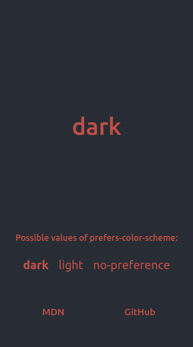
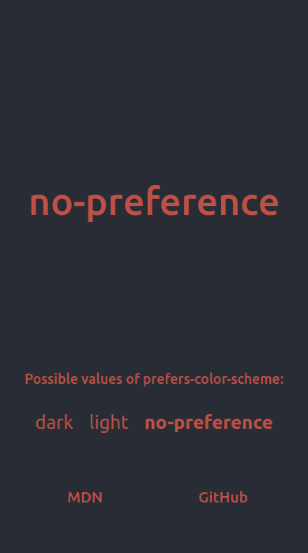

# [What is my prefers-color-scheme?](https://henriquetf.github.io/what-is-my-prefers-color-scheme/) &middot; 

Quickly find out what color scheme your browser is currently using.

JavaScript is not needed for it to work.

[According to MDN](https://developer.mozilla.org/en-US/docs/Web/CSS/@media/prefers-color-scheme), the `prefers-color-scheme` media can be set to the following values:

- **no-preference:** Indicates that the user has made no preference known to the system.

  - Defaults to `light` in most cases.

  - Web applications that run `matchMedia('(prefers-color-scheme: dark)')` to check if `dark` is the preferred color scheme will default to `light`.

- **light:** Indicates that user has notified the system that they prefer an interface that has a light theme.
- **dark:** Indicates that user has notified the system that they prefer an interface that has a dark theme.

### Preview

### License

[MIT](./LICENSE).
